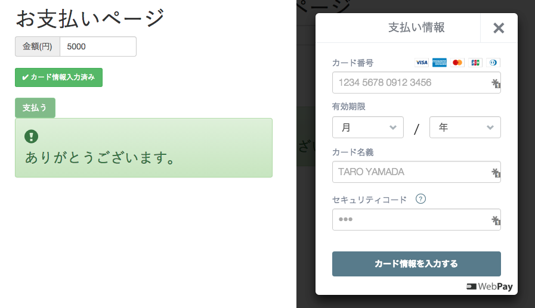

# silex-webpay-bootstrap

PHP フレームワークの Silex で開発された WebPay の決済アプリです。トップページのみのアプリで商品を追加するには HTML を修正します。

## 問い合わせ

バグ報告や機能追加要望などの問い合わせは
Issues もしくは E メール (`masakielastic@gmail.com`)、[Facebook](https://www.facebook.com/masakielastic) や Line (masakielastic) などからお願いします。

## スクリーンショット


## サーバーの要件

  * Apache HTTP サーバー - mod_rewrite (URI の書き換え) と mod_ssl (SSL/TLS) が利用できること。
  * PHP 5.4.0 とそれ以降 - [webpay-php](https://github.com/webpay/webpay-php) を使うため。
  * `random_bytes` (PHP 7 から標準関数) もしくは `openssl_random_pseudo_bytes` (OpenSSL エクステンション)が利用できること。ランダムな文字列の生成のため。

## ダウンロード

「[release](https://github.com/masakielastic/silex-webpay-bootstrap/releases)」のページから入手したファイル (`silex-webpay-bootstrap.zip`) を展開します。`git` を使う場合は次のコマンドを実行します。`composer`、`npm`、`bower` はあらかじめインストールしてあることが前提です。

```bash
git clone https://github.com/masakielastic/silex-web-bootstrap.git
cd silex-webpay-bootstrap
composer install
npm install
bower install
```

## インストール

動作の確認を目的とした方法を説明します。利用するドメインを `example.org` とします。実際の作業の際にはご利用のドメインに置き換えて考えてください。

まず `https://example.org/silex-webpay-bootstrap/` にアクセスできる位置に `silex-webpay-bootstrap` フォルダーを FTP/FTPS ソフトでアップロードします。

次に `app` フォルダーで `config.example.php` をコピーして `config.php` をつくります。[WebPay のユーザ設定](https://webpay.jp/settings)のページで表示されるテスト環境用公開可能鍵とテスト環境用非公開鍵を記入します。

```php
// test_public_XXXXXXXXXX
'public_key' => 'test_public_XXXXXXXXXX',
// test_secret_XXXXXXXXX
'private_key' => 'test_secret_XXXXXXXXX',
```

## 動作の確認

実際にフォームに金額とクレジットカードの情報を入力して課金されることを確かめます。

テスト環境で利用可能なクレジットカードの番号の一覧およびそれ以外の入力情報は[こちら](https://webpay.jp/docs/mock_cards)のページで公開されています。フォームを投稿して、投稿が成功したことを示すメッセージを見た後で、[ダッシュボード](https://webpay.jp/test/dashboard)を確認しましょう。

## WordPress のテーマを使う

[こちら](https://github.com/masakielastic/wp-webpay-bootstrap)のリポジトリから `index.example.php` を手に入れて、`views` フォルダーに設置します。WordPress のテーマを読み込むために `index.example.php` に記載される `wp-blog-header.php` へのパスを修正します。

```php
include '/path/to/wp-blog-header.php';
```

## 実際にアプリを運用する場合に必要な作業
### ディレクトリ構成の変更

実際にアプリケーションを運用する場合、WebPay の非公開鍵などの情報を盗まれないように `app`  フォルダーはインターネットからアクセスできない位置に設置します。そして `index.php` に記載されている `app/app.php` へのパスを修正します。

```php
/path/to/app/app.php
```

### ビューファイルの修正

`views` フォルダーにあるビューファイル (`index.example.twig`) をカスタマイズする場合、今後のアップデート作業の際に、間違って上書きしてしまわないようにファイルの名前を変えるとよいでしょう。

たとえば、
`index.example.twig` や `layout.example.twig` をコピーして `index.twig` および `layout.twig` をつくります。そして `index.twig` の冒頭の行も修正します。

```bash

```

読み込まれるファイルの名前や優先順位は `config.php` の `views` で調整してください。

### レンタルサーバーを利用する場合の注意事項
#### 共有 SSL を利用する

Cookie の情報を盗まれないようにするために、ほかのユーザーと区別がつくサブドメインが利用できるサービスを選ぶことをおすすめします。

 * [さくらインターネット](https://help.sakura.ad.jp/app/answers/detail/a_id/2331) - `https://******.sakura.ne.jp/`
 * [ロリポップ](http://lolipop.jp/manual/user/ssl/) - `https://□□□-○○○.ssl-lolipop.jp/`
 * [XSERVER](https://www.xserver.ne.jp/manual/man_server_ssl.php) - `https://example-com.ssl-xserver.jp/`
 * [FIREBIRD](http://www.firebird.jp/support/man/domain_shared_ssl.php) - `https://example-com.ssl-netowl.jp/`

#### 独自ドメインと SSL/TLS

年間1〜2万円前後で SSL/TLS 証明書の更新を代行してくれるレンタルサーバーの例です。

 * [ロリポップ](http://lolipop.jp/ssl/)
 * [XSERVER](https://www.xserver.ne.jp/price/price_ssl.php) 
 * [FIREBIRD](http://www.firebird.jp/service/install_ssl_certify.php)

## ライセンス

MIT とします。
