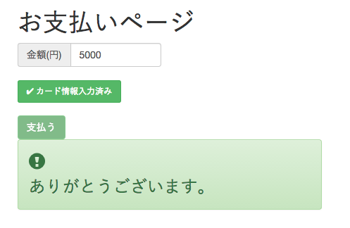
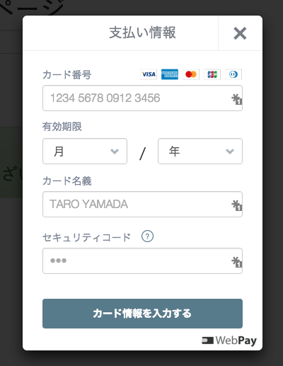

# silex-webpay-bootstrap

Silex で開発された WebPay の決済アプリです。

## スクリーンショット




## サーバーの要件

  * Apache HTTP サーバー - mod_rewrite (URI の書き換え) と mod_ssl (SSL/TLS) が利用できること。
  * PHP 5.4.0 とそれ以降 - [webpay-php](https://github.com/webpay/webpay-php) を使うため。
  * `random_bytes` (PHP 7 から標準関数) もしくは `openssl_random_pseudo_bytes` (OpenSSL エクステンション)が利用できること。ランダムな文字列の生成のため。

## ダウンロード

「[release](https://github.com/masakielastic/silex-webpay-bootstrap/releases)」のページから入手したファイル (`silex-webpay-bootstrap.zip`) を展開します。`git` および `composer` を使う場合は次のようになります。

```bash
git clone https://github.com/masakielastic/silex-web-bootstrap.git
cd silex-webpay-bootstrap
composer update
npm install
bower install
```

## インストール

まずは動作の確認を目的とした設置方法を説明します。ドメインの例として `example.org` を使います。`https://example.org/silex-webpay-bootstrap/web` にアクセスできるように `silex-webpay-bootstrap` フォルダーを FTP/FTPS ソフトでアップロードします。次に `app` フォルダーで `config.example.php` をもとに `config.php` をつくります。[WebPay のユーザ設定](https://webpay.jp/settings)のページで表示されるテスト環境用公開可能鍵とテスト環境用非公開鍵を記入します。

## 動作の確認

実際にフォームに金額とクレジットカードの情報を入力して課金されることを確かめてみましょう。テスト環境で利用可能なクレジットカードの番号の一覧およびそれ以外の入力情報は[こちら](https://webpay.jp/docs/mock_cards)のページで公開されています。フォームを投稿して、投稿が成功したことを示すメッセージを見た後で、[ダッシュボード](https://webpay.jp/test/dashboard)も確認してみましょう。

## WordPress のテンプレートを使う

[こちら](https://github.com/masakielastic/wp-webpay-bootstrap)のリポジトリから `index.example.php` を手に入れて、`views` フォルダーに設置してください。WordPress の `wp-blog-header.php` を読み込むためにパスを修正します。

```php
include '/path/to/wp-blog-header.php';
```

`config.php` を修正して、`index.example.php` を優先して読み込むようにします。

```php
'views' => ['index.example.php', 'index.example.twig'],
```

## ディレクトリやファイルのカスタマイズ

WebPay の非公開鍵などの情報を盗まれないように `web` フォルダー以外のすべてのファイルはインターネットからアクセスできない位置に設置します。
`web` フォルダーに含まれるファイルはすべてインターネットからアクセスできる位置に設置します。隠しファイルの `.htaccess` も含まれていることもお忘れなく。OS での表示方法がわからなければ、[こちらの URL](https://github.com/masakielastic/silex-webpay-bootstrap/blob/master/web/.htaccess) から入手してください (「Raw」からダウンロードできます)。そして `index.php` に記載されている `app/app.php` へのパスを修正します。

```php
/path/to/app/app.php
```

`views` フォルダーに入っているビューファイル (`index.example.twig` )をカスタマイズする場合、今後のアップデート作業の際に、間違って上書きしてしまわないようにファイルの名前を変えるとよいでしょう。

たとえば、
`index.example.twig` や `layout.example.twig` をコピーして `index.twig` および `layout.twig` をつくります。そして `index.twig` の冒頭の行も修正します。

```bash

```

次に `config.php` の `views` で指定するファイル名も修正します。

```php
'views' => ['index.twig', 'index.php'],
```

## レンタルサーバーを利用する場合の注意事項
### 共有 SSL を利用する

Cookie の情報を盗まれないようにするために、ほかのユーザーと区別がつくサブドメインが利用できるサービスを選ぶことをおすすめします。

 * [さくらインターネット](https://help.sakura.ad.jp/app/answers/detail/a_id/2331) - `https://******.sakura.ne.jp/`
 * [ロリポップ](http://lolipop.jp/manual/user/ssl/) - `https://□□□-○○○.ssl-lolipop.jp/`
 * [XSERVER](https://www.xserver.ne.jp/manual/man_server_ssl.php) - `https://example-com.ssl-xserver.jp/`
 * [FIREBIRD](http://www.firebird.jp/support/man/domain_shared_ssl.php) - `https://example-com.ssl-netowl.jp/`

### 独自ドメインと SSL/TLS

年間1〜2万円前後で SSL/TLS 証明書の更新を代行してくれるレンタルサーバーの例です。

 * [ロリポップ](http://lolipop.jp/ssl/)
 * [XSERVER](https://www.xserver.ne.jp/price/price_ssl.php) 
 * [FIREBIRD](http://www.firebird.jp/service/install_ssl_certify.php)

## ライセンス

MIT とします。
